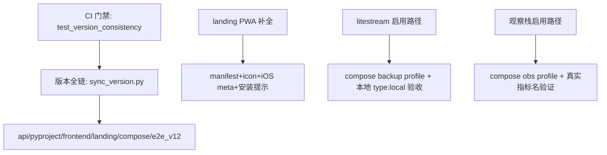

# Implementation Plan: 001-v21-ar-closure

> Spec-Kit Phase 4 ｜ 技术策略：复用既有轮子 + 最小改动 + 可验证闭环。

## Technology Stack（技术栈，沿用项目现状，不引入新框架）

| 层 | 现状 | 本期动作 |
|---|---|---|
| 后端 | Python 3.11+/FastAPI/pytest 9.1.1 | 新增 `tests/test_version_consistency.py` + `scripts/sync_version.py` + 测试隔离修复；`scripts/uptime_probe.py` |
| 前端 | React19/Vite6/vitest（node_modules 缺失，本期不实跑） | DLQ i18n 补 key + 组件去硬编码；验证靠静态分析 + 既有 i18n 测试机制锁定 |
| 落地页 | Vue3/Vite6 | 补 manifest + icon + iOS meta + PwaInstallPrompt 组件 + sitemap/robots/JSON-LD |
| 部署 | docker-compose（obs/backup profile 已定义） | 启用路径文档化 + `.env.production.example` 补 LITESTREAM_* + 验证命令 |
| 工具 | PowerShell/Node（Windows 禁 .sh） | sync_version.py / uptime_probe.py 均为 Python（跨平台） |

## Architecture（架构要点）

### 关键设计决策
1. **版本门禁走测试而非 hook**：`test_version_consistency.py` 读全链文件比对（pyproject/main.py/package.json/docker-compose/README/e2e_v12 断言），CI 首步 fail-fast——比 hook 更透明可审计，且 pytest 已可用无需新依赖。`sync_version.py` 幂等批量改写。
2. **测试隔离改实例属主**：AccountPool 模块级共享状态→实例 `self._*`；不破坏 `_pkg_attr` 契约（只动状态持有，不动读取路径）。
3. **PWA 走手写 manifest 而非 vite-plugin-pwa**：landing 已有 sw.js + 原生注册（index.html:152），最轻路径 = 补 manifest.webmanifest + 图标 + Vue 组件；不引新依赖、不重写 SW。
4. **litestream 本地验收用 type:local**：S3 类型不支持 file:// endpoint；不改生产 litestream.yml，临时验收配置 + 真实二进制跑（可逆本地操作）。
5. **观察栈验证用真实指标名**：`imagefree_requests_total`（实测 api/metrics_ext.py），不臆造 `http_request_duration_seconds`。

## Dependencies（依赖识别）

| 任务 | 依赖 | 并行性 |
|---|---|---|
| T1 版本门禁测试（先红） | 无 | [P] |
| T2 sync_version.py | 无 | [P] |
| T3 隔离复现测试 | T1 后（同一测试批） | 串行优先 |
| T4 DLQ i18n | 无（独立文件） | [P] |
| T5 PWA manifest/icon/组件 | 无 | [P] |
| T6 litestream 启用路径文档+模板 | 无 | [P] |
| T7 观察栈验证命令 + uptime_probe | 无 | [P] |
| T8 SEO sitemap/robots/JSON-LD | 无 | [P] |
| T9 旧产物清理清单 | 无 | 需确认保留项 |
| T10 全链版本统一 + dist 重建 | T1/T2 | 收尾 |

## Security Considerations（安全）

- 版本脚本只读/写文本文件，不触碰运行时数据；`--dry-run` 只读。
- uptime_probe 仅 GET /v1/healthz（公开端点），不携带任何 key。
- PWA manifest 无敏感字段；SW 三策略保持、不缓存 query 串 URL。
- litestream 本地副本仅本机目录，不写外网；R2 真凭证需授权后才落地 .env。
- 测试新增 fixture 不用模块级可变默认；tmp_path 用 `tmp_path_factory.mktemp` 唯一目录防串扰。

## Performance Strategy（性能）

- 版本门禁测试全程 <2s（仅文件读取比对），CI 零负担。
- sync_version.py 批量正则替换，一次进程完成 ~15 处。
- 不新增任何热路径改动（主链路零接触）。
- uptime_probe 间隔由用户文档决定（不内嵌高频轮询）。

## Error Handling（错误处理）

- sync_version.py：文件缺失→报告并 fail；`--dry-run` 不落盘；`--check` 只读校验。
- 版本门禁测试：任一文件缺失→fail（通知先补），不静默跳过。
- PWA 组件：`beforeinstallprompt` 不支持的环境静默降级（iOS 走 standalone 检测）。
- litestream 本地验收：二进制缺失→提示安装命令，不假装成功。
- 测试隔离：新 fixture 失败即中止该用例，不留半态。

## 验收维度（对应 spec AC）

1. `pytest tests/test_version_consistency.py -q`：当前红（20.3.10≠20.3.11）→ 修复后绿。
2. `pytest tests/test_account_pool.py tests/test_account_fsm_self_heal.py tests/test_account_predict_exhaustion.py -q`：组合 0 污染。
3. i18n `isLangComplete()` 断言：messages.zh/en 补 dlq.* 后一致；DLQ.tsx 中文硬编码 0（静态 rg 验证）。
4. `ls landing/dist/manifest.webmanifest` + index.html link + sw.js 三策略保留。
5. `.env.production.example` 含 LITESTREAM_* 六变量；SOP §3 + 架构演进文档声明启用路径。
6. `python scripts/uptime_probe.py`（若起服务）连续 3 次 200；否则 dry-run 语法校验。
7. 旧产物：清理未跟踪临时文件（`_dep33.py`/`_srv_py.py`/`frontend/_admin_explain.cjs`/`landing/dev-proxy.mjs` 按需保留声明）。